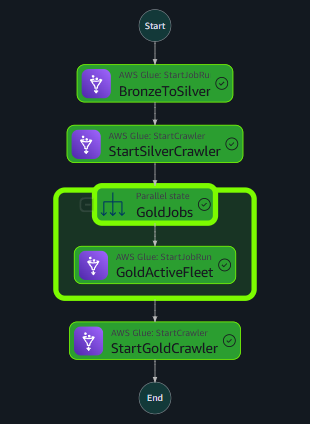

## Workflow Diagram

```mermaid
graph LR

classDef s3 fill:#cce5ff,stroke:#004085,stroke-width:2px,color:#004085;
classDef glue fill:#d4edda,stroke:#28a745,stroke-width:2px,color:#155724;
classDef cat fill:#fff3cd,stroke:#856404,stroke-width:2px,color:#856404;
classDef endp fill:#e2e3e5,stroke:#383d41,stroke-width:2px,color:#383d41;
classDef sfn fill:#ced4da,stroke:#495057,stroke-width:3px,color:#212529;

API[WAW API<br/>Data Pull] --> B[(S3 Bronze)]

subgraph SFN["AWS Step Functions<br/>Pipeline Orchestration"]
    direction LR

    J1[Glue Job<br/>Bronze → Silver]
    S[(S3 Silver)]
    C1[Silver Crawler]
    DBS[(Glue Catalog)]

    J1 --> S
    S --> C1
    C1 --> DBS
    DBS --> GoldJobs

    subgraph GoldJobs["Parallel Gold Glue Jobs"]
        direction TB

        G1[stop_congestion]
        G2[line_speed_anomalies]
        G3[active_fleet]
        G4[incident_impact]
    end

    GLD[(S3 Gold)]
    C2[Gold Crawler]
    DBG[(Glue Catalog)]

    GoldJobs --> GLD
    GLD --> C2
    C2 --> DBG

end

B --> J1

DBG --> ATH[Athena Analytics]


class B,GLD,S s3;
class J1,C1,G1,G2,G3,G4,C2 glue;
class DBS cat;
class DBG cat;
class API,ATH endp;
class SFN sfn;
```


## AWS Step Func. preview


## AWS Lambda problem

Planned on using AWS lambda for ingestion process , I set it up but AWS was unable to retrieve any data from the Warsaw's API due to repeated timeouts <br>
Issue appears to be related to inaccessible API while using AWS enviroment possibly due to Warsaw's API filtering.  
Since it worked locally I switched to more suitable approach to ingest data and upload it to S3 manually via ```ingestion.py```
